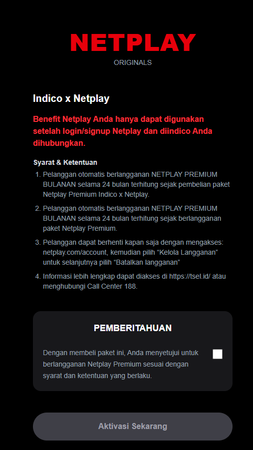
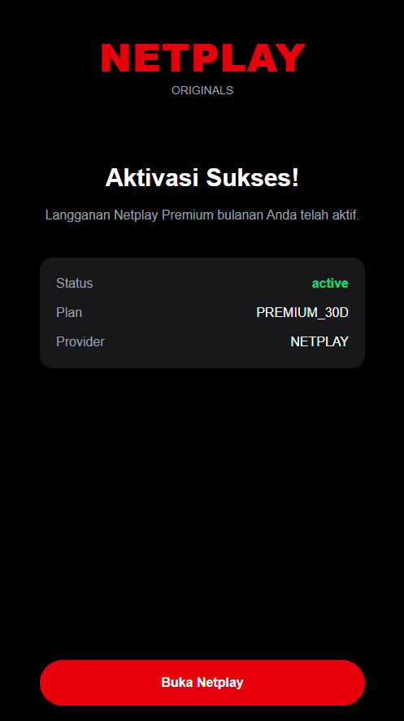
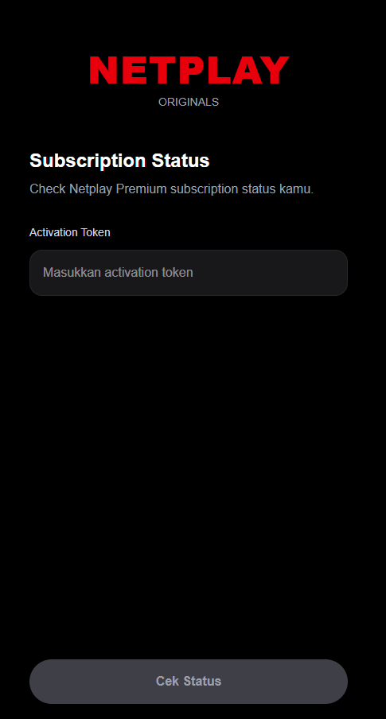
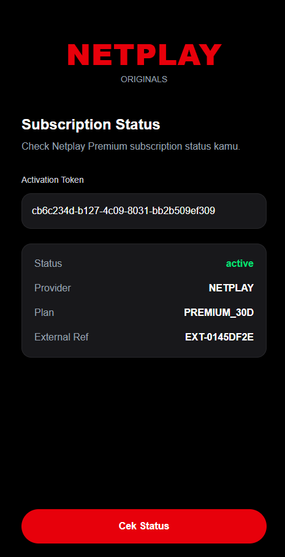

# INDICO OTT Integration Service - Frontend

Frontend application untuk technical test Fullstack Engineer INDICO.

Frontend ini digunakan untuk:
- Aktivasi subscription OTT
- Menampilkan activation result
- Mengecek subscription status

Frontend terintegrasi dengan backend OTT Integration Service menggunakan REST API.

---

# Tech Stack

- React
- Vite
- Tailwind CSS
- Axios
- React Router DOM

---

# Fitur

- Activation page
- Subscription status page
- Responsive UI
- Loading state
- Success state
- Error state
- API integration dengan backend service

---

# Struktur Project

```text
src/
├── api/
├── components/
├── pages/
├── services/
├── App.jsx
├── main.jsx
└── index.css
```

---

# Halaman

## Activation Page

```text
/activation/:activationCode
```

Digunakan untuk:
- membuka activation link
- melakukan aktivasi subscription
- menampilkan hasil aktivasi

---

## Subscription Status Page

```text
/status
```

Digunakan untuk:
- mengecek status subscription
- melihat provider
- melihat plan subscription
- melihat subscription status

---

# Setup Environment

Buat file:

```text
.env
```

Isi:

```env
VITE_API_BASE_URL=http://localhost:8080/v1/api
```

---

# Install Dependency

```bash
npm install
```

---

# Menjalankan Frontend

```bash
npm run dev
```

Frontend berjalan di:

```text
http://localhost:5173
```

---

# API Integration

Frontend menggunakan REST API dari backend service berikut:

| Endpoint | Method | Description |
|---|---|---|
| `/v1/api/subscriptions/activate` | POST | Aktivasi subscription |
| `/v1/api/subscriptions/subscription-status` | GET | Mengecek status subscription |

---

# UI State

Frontend mengimplementasikan beberapa UI state:

## Loading State
Digunakan saat:
- memuat halaman
- melakukan API request

## Success State
Digunakan saat:
- aktivasi berhasil
- status subscription berhasil didapatkan

## Error State
Digunakan saat:
- API gagal
- activation code invalid
- provider error

---

# Routing

Routing menggunakan React Router DOM.

Available routes:

```text
/activation/:activationCode
/status
```

# Design 

Activation 

```

```

Success Activation

```

```

Cek Status
```

```

Subscription Status
```
#
```
